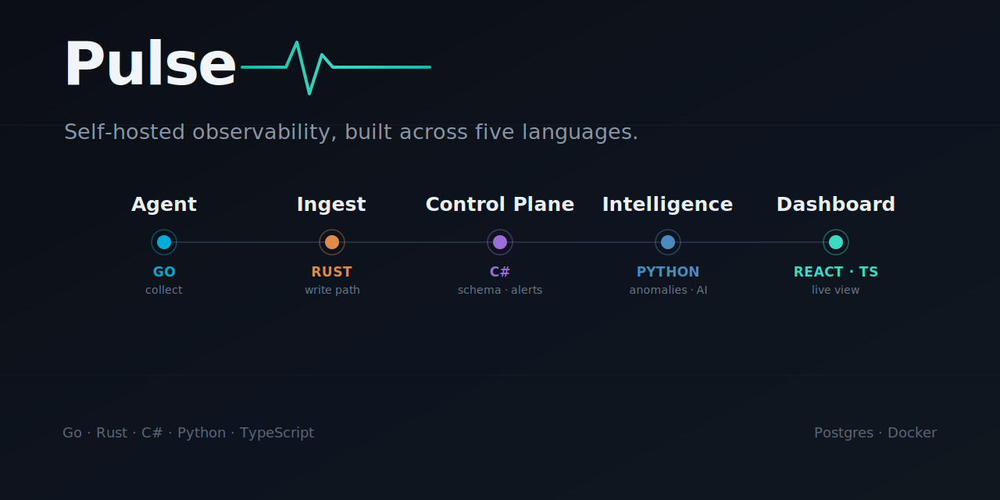

# Pulse

> Self-hosted monitoring with a brain. Uptime + host metrics + alerting, with AI incident summaries. A polyglot system built to learn Go, Rust, and Python while showcasing C# and React.

Status: agent → ingest → Postgres pipeline working; control plane in progress; intelligence and dashboard planned

## Languages & why each is here

| Service | Language | Learning goal |
|---|---|---|
| `agent/` | Go | Learn — first Go project; static binary, goroutines |
| `ingest/` | Rust | Learn — async Rust, ownership on a real network service |
| `control-plane/` | C# | Showcase — the depth piece |
| `intelligence/` | Python | Learn — data handling + LLM integration |
| `dashboard/` | TypeScript/React | Half-learn — typed frontend against a generated client |

## Transport — how the services talk

Everything is **HTTPS**, with **WebSockets** for the one live-push edge. No raw TCP/UDP, no gRPC (yet). Each choice is justified so you can defend it.

```
agent ──HTTPS (JSON; protobuf later)──▶ ingest ──▶ Postgres
                                                      ▲  ▲
control-plane ──owns schema, reads/writes────────────┘  │
     │  ▲                                                │
     │  └──HTTPS────────────────────── intelligence ─────┘
     │                                  (reads metrics, writes insights)
     ▼
  dashboard   (HTTPS REST  +  WebSockets/SignalR for live updates)
```

| Edge | Transport | Why |
|---|---|---|
| agent → ingest | HTTPS POST, JSON now / protobuf-over-HTTP later | curl-debuggable; binary only when volume justifies it |
| ingest → Postgres | TCP (Postgres wire) | bulk inserts |
| control-plane ↔ Postgres | TCP (Postgres wire) | owns the schema |
| intelligence ↔ Postgres | TCP (Postgres wire) | reads metrics, writes anomalies/insights |
| control-plane → dashboard | HTTPS REST + WebSockets (SignalR) | request/response + live status push |
| control-plane → notifications | HTTPS out | webhooks/Slack/email |

**Postgres is the integration contract.** `control-plane` owns the schema via EF Core migrations; no other service creates tables.

## The metric payload contract

Decide this early — it's what agent, ingest, and intelligence all depend on. Defined in [`agent/README.md`](./agent/README.md) and mirrored by `ingest`. Changing it later touches three services, so get it roughly right first.

## Build order

Each step ends with something that runs. Don't move on until it does.

1. **`agent` — collection only.** Gather metrics, print JSON to stdout. No network. A complete Go program with zero dependencies on other services.
2. **`ingest` — receiver.** Rust service accepting the agent payload over HTTP, writing to Postgres. (You're going straight to Rust here — accept that steps 1–2 are two new languages before anything connects.)
3. **Wire `agent` to ship** to `ingest`. First end-to-end pipeline.
4. **`control-plane`** — uptime checks, incidents, alerts, the API + SignalR hub.
5. **`dashboard`** — see it all, live.
6. **`intelligence`** — anomalies + AI summaries.

## Repo conventions

- Each service is self-contained: own README, own tests, own Dockerfile, no cross-folder imports.
- Only shared dependency between services is Postgres + the HTTP contracts above.
- `docker compose up -d postgres` for local dev.